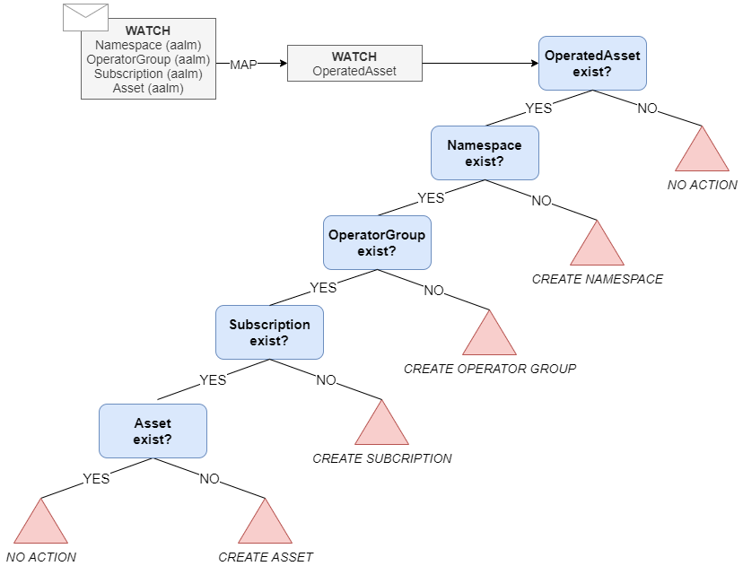

# Altemista Asset Lifecycle Manager Architecture
AALM uses OLM resources to create the operator with the necessary permissions in an isolated way for the final user. The goals of this architecture are explained [here](design-goals.md).

AALM is composed by one operator that manages the `OperatedAsset` CRD that is the basis of the Altemista Asset Lifecycle Manager.

AALM is responsible of the creation of the following resources:
- _Namespace_
- _OperatorGroup_
- _Subscription_ 
- _`Asset`_

## What is an OperatedAsset?
`OperatedAsset` combine information of the operator needed to be created based on an OLM Subscription and the instance of the Asset to be operated.

OperatedAsset:
* `operator`: OLM Subscription to instantiate (by OLM) the operator of the desired Asset. 
* `asset`: the instance of the desired asset that is going to be operated by the previous operator. Once the operator is created in the operator namespace, the `asset` Custom Resource of the instance will trigger the creation (by the operator) of all resources needed to use this application.

## OperatedAsset Decision Tree
In order to manage all the resources, the following decision tree has been designed and implemented:

The idea of the decision tree is mapping all the managed resources by AALM to the OperatedAsset in order to control the creation of all the resources.

## Managed resources
All the resources managed by the AALM are mapped to an `OperatedAsset` in order to have a way of managing all the management of this Custom Resource. AALM is responsible of the creation of the following resources:

### Namespace
When an user creates an `OperatedAsset` in a namespace called `[user-namespace]`, a new `Namespace` is created in order to manage all the OLM resources. This allows using OLM operators without the need of high level priviledges in the cluster.

The namespace will be called `[user-namespace]-operators`. 

Once the namespace is created, the AALM watches it in order to manage all the possible changes or deletion. 

### OperatorGroup
The `OperatorGroup` define where the OLM operators will watch for their Custom Resources. AALM configures the OperatorGroup to point to the `[user-namespace]`.

As the namespace, once the AALM creates the `OperatorGroup` it will watch events related with it. If the `OperatorGroup` is deleted a new Reconcile loop will be triggered and the controller will detect the deletion so it will create it again.

### Subscription
This OLM resource allows to configure how OLM creates the operator. Once the operator is created, it will watch all the specific operator Custom Resource(s) in the `[user-namespace]` in order to install/manage/remove the application.

It is managed in the same way as the namespace and the OperatorGroup.

### Asset
The main difference between using just OLM and AALM is that AALM, using the `OperatorAsset`, also creates the instance of the operated application. This Asset is packaged in a Custom Resource (depending on the operator), is created in the `[user-namespace]` and managed by the operator that is created by OLM (because of the Subscription resource creation) in the `[user-namespace]-operators`.

In the `OperatedAsset` definition, the final user can configure how to the operated application will be installed or managed.

It is managed in the same way as the namespace and the OperatorGroup and the Subscription but in the `[user-namespace]`.

## TODO
This list contains different functionalities to be implemented.

### Finalizers
At this moment, the AALM manage all the resources creation. 

In case of the deletion of the `OperatedAsset`, all the operator (OLM) resources are not removed (namespace, OperatorGroup and Subscription). In the future, the finalizers of this resources will be implemented in order to remove the operator namespace in case no operators were managing any Asset.